# گزارش آزمایش سوم مهندسی نرم‌افزار

## توسعهٔ آزمون‌محور سبد خرید (TDD Shopping Cart)

این مخزن گزارش و پیاده‌سازی آزمایش «مفاهیمی در آزمون نرم‌افزار» است. هدف آزمایش، شناخت پروژهٔ پایه، کشف رفتارهای پوشش‌داده‌نشده، اصلاح تدریجی سیستم با چرخهٔ **Red–Green–Refactor** و ارزیابی کیفیت تست‌ها با **JaCoCo** و **PIT Mutation Testing** است.

پروژه به‌صورت انفرادی انجام شده و به‌جای Hamgit از مخزن عمومی GitHub استفاده شده است:

---

## ۱. اهداف آزمایش

اهداف اصلی این فعالیت عبارت‌اند از:

1. اجرای پروژهٔ اولیه و انجام Baseline Analysis؛
2. اندازه‌گیری پوشش اولیهٔ تست‌ها؛
3. کشف و مستندسازی حداقل سه رفتار معیوب یا تعریف‌نشده؛
4. طی‌کردن چرخهٔ Red–Green–Refactor برای هر تغییر؛
5. پیاده‌سازی `updateItemPrice` با حداقل هشت تست معنادار؛
6. افزودن یک قابلیت تجاری دوم با TDD؛
7. استفاده از تست‌های مرزی، پارامتریک و exception؛
8. مقایسهٔ Coverage اولیه و نهایی؛
9. ارزیابی قدرت تست‌ها با Mutation Testing؛
10. ثبت نقش ابزار هوش مصنوعی و امکان بازتولید نتایج.

## ۲. ساختار پروژه

```text
.
├── src/
│   ├── ShoppingCart.java
│   ├── Item.java
│   └── Main.java
├── Test/
│   ├── ShoppingCartTest.java
│   ├── ShoppingCartBugTest.java
│   ├── ShoppingCartAdvancedTest.java
│   └── CartCapacityTest.java
├── docs/evidence/
├── AI_CHATBOT.md
├── pom.xml
└── README.md
```

به‌دلیل ساختار غیرمتعارف پروژهٔ پایه، مسیرهای `src` و `Test` در `pom.xml` به‌ترتیب به‌عنوان source و test source معرفی شده‌اند.

## ۳. اجرای پروژه و بازتولید نتایج

پیش‌نیازها:

- JDK 17 یا جدیدتر؛
- Maven 3.x.

اجرای همهٔ تست‌ها و تولید گزارش JaCoCo:

```bash
mvn clean test
```

یا برای اجرای چرخهٔ کامل Maven:

```bash
mvn clean verify
```

گزارش JaCoCo پس از اجرا در مسیر زیر قرار می‌گیرد:

```text
target/site/jacoco/index.html
```

اجرای PIT:

```bash
mvn test-compile org.pitest:pitest-maven:mutationCoverage
```

گزارش PIT در مسیر زیر تولید می‌شود:

```text
target/pit-reports/index.html
```

## ۴. تحلیل اولیه (Baseline Analysis)

در نسخهٔ اولیه چهار تست وجود داشت و هر چهار تست پاس می‌شدند، اما عبور تست‌ها به معنی کامل‌بودن رفتار سیستم نبود. ساختار داخلی سبد یک `Map<String, Double>` بود و چند شکاف مهم مشاهده شد:

- افزودن نام تکراری، قیمت قبلی را بدون خطا بازنویسی می‌کرد؛
- نام `null` یا خالی و قیمت صفر، منفی، `NaN` یا بی‌نهایت اعتبارسنجی نمی‌شد؛
- شرط تخفیف مرز ۱۰۰ را درست مدل نمی‌کرد؛
- متد `updateItemPrice` پیاده‌سازی نشده بود؛
- سقفی برای تعداد اقلام وجود نداشت؛
- مسیرهایی مانند حذف کالای ناموجود توسط تست‌ها اجرا نمی‌شدند.

جدول زیر نشان می‌دهد چرا عبور تست‌های baseline برای اطمینان از صحت سیستم کافی نبود:

| رفتار | وضعیت نسخهٔ پایه | دلیل عبور تست‌های قدیمی | قرارداد انتخاب‌شده |
|---|---|---|---|
| نام تکراری | قیمت قبلی overwrite می‌شد | هیچ تستی افزودن دوبارهٔ یک نام را انجام نمی‌داد | رد عملیات با `IllegalArgumentException` و حفظ state |
| نام نامعتبر | `null` و blank پذیرفته می‌شد | تست‌ها فقط نام معتبر داشتند | رد نام تهی یا بدون محتوای معنادار |
| قیمت نامعتبر | صفر، منفی و مقدار غیرمتناهی پذیرفته می‌شد | فقط قیمت‌های مثبت معمولی استفاده شده بود | قیمت باید مثبت و finite باشد |
| مرز تخفیف | شرط `>= 100` بود | تست پایه انتظار ناسازگار `90` برای مرز ۱۰۰ داشت | طبق PDF، تخفیف فقط برای `> 100` |
| تغییر قیمت | متد خالی بود | تست‌های مربوطه در نسخهٔ پایه فعال نبودند | تغییر قیمت موجود بدون تغییر count |
| ظرفیت | محدودیتی وجود نداشت | تعداد زیاد کالا آزمایش نشده بود | حداکثر ۱۰۰ کالا و رد اتمیک کالای ۱۰۱ام |

اجرای اولیه:

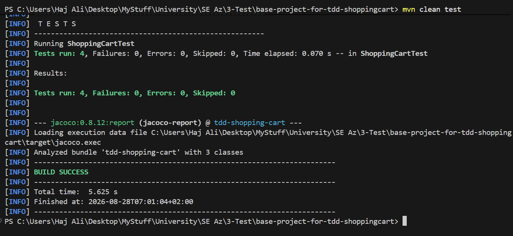

پوشش اولیهٔ کلاس `ShoppingCart`:

| معیار | مقدار اولیه |
|---|---:|
| Instruction Coverage | 92٪ |
| Branch Coverage | 66٪ |
| خطوط ازدست‌رفته | 3 از 19 |
| متدهای ازدست‌رفته | 1 از 7 |

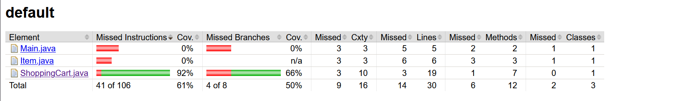

## ۵. چرخه‌های TDD برای رفتارهای معیوب

### ۵.۱. جلوگیری از نام تکراری کالا

رفتار اولیهٔ `Map.put` باعث می‌شد افزودن دوبارهٔ یک نام، قیمت قبلی را بی‌صدا بازنویسی کند. قرارداد انتخاب‌شده این بود که نام کالا یکتا باشد و تلاش دوم با `IllegalArgumentException` رد شود؛ در عین حال تعداد و مجموع سبد تغییر نکند.

تست آشکارکننده:

```java
@Test
void duplicateItemNameShouldBeRejectedWithoutChangingCart() {
    ShoppingCart cart = new ShoppingCart();
    cart.addItem("Book", 50.0);

    assertThrows(
            IllegalArgumentException.class,
            () -> cart.addItem("Book", 80.0)
    );

    assertEquals(1, cart.getItemCount());
    assertEquals(50.0, cart.getTotal(), 0.0001);
}
```

- **Red:** تست جدید به‌علت عدم پرتاب exception شکست خورد.
- **Green:** پیش از `put` وجود نام با `containsKey` بررسی شد.
- **Regression:** همهٔ تست‌های قبلی همچنان پاس شدند.

تحلیل فنی این باگ:

| مؤلفه | توضیح |
|---|---|
| ورودی آشکارکننده | افزودن `("Book", 50)` و سپس `("Book", 80)` |
| نتیجهٔ معیوب | تعداد یک باقی می‌ماند، اما قیمت ۵۰ بدون اعلام خطا به ۸۰ تبدیل می‌شد |
| علت ریشه‌ای | استفادهٔ مستقیم از `Map.put` بدون بررسی `containsKey` |
| علت کشف‌نشدن | تست اولیه فقط یک بار کالا اضافه می‌کرد |
| اصلاح حداقلی | بررسی وجود نام پیش از `put` و پرتاب exception |
| تضمین عدم اثر جانبی | assertion هم‌زمان روی count و total بعد از exception |

| Red | Green |
|---|---|
| 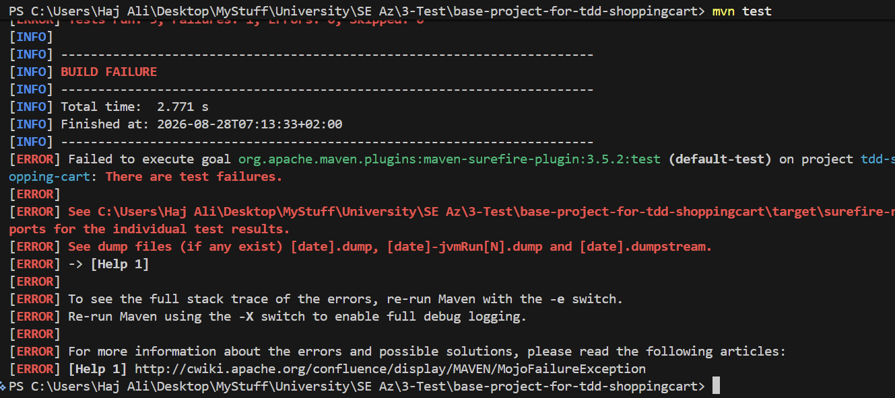 | 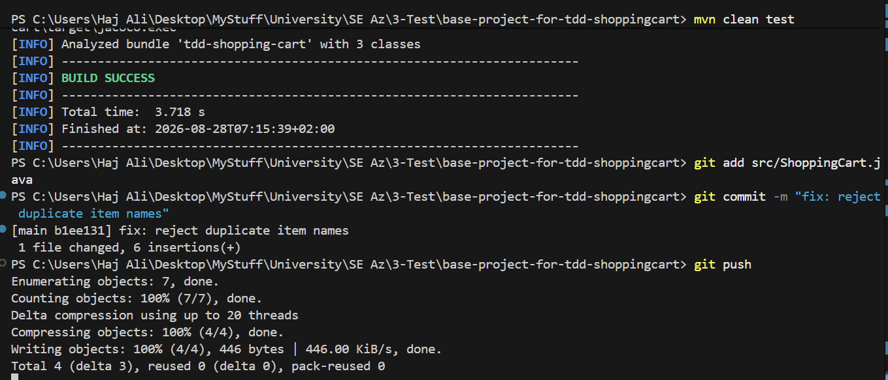 |

### ۵.۲. اعتبارسنجی نام و قیمت

ورودی‌های نامعتبر می‌توانستند وضعیت سبد و محاسبات بعدی را غیرقابل اعتماد کنند. تست‌های پارامتریک برای نام‌های `null`، خالی و whitespace و قیمت‌های صفر و منفی نوشته شدند. `NaN` و `Infinity` نیز به‌صورت جداگانه بررسی شدند.

راه‌حل نهایی در دو helper متمرکز شد:

```java
private void validateName(String name) {
    if (name == null || name.isBlank()) {
        throw new IllegalArgumentException("Item name must not be blank");
    }
}

private void validatePrice(double price) {
    if (!Double.isFinite(price) || price <= 0.0) {
        throw new IllegalArgumentException(
                "Price must be a positive finite value"
        );
    }
}
```

این refactor از تکرار منطق اعتبارسنجی میان `addItem` و `updateItemPrice` جلوگیری می‌کند.

تحلیل فنی این مرحله:

| دسته | داده‌های آزمون | انتظار |
|---|---|---|
| نام نامعتبر | `null`، `""`، `" "`، `"   "` و tab | `IllegalArgumentException` |
| قیمت مرزی | `0.0` و `-0.01` | `IllegalArgumentException` |
| قیمت منفی | `-1.0` و `-100.0` | `IllegalArgumentException` |
| مقدار غیرمتناهی | `NaN` و `POSITIVE_INFINITY` | `IllegalArgumentException` |
| دادهٔ معتبر | نام معنادار و قیمت مثبت finite | افزودن عادی کالا |

استفاده از `Double.isFinite` ضروری بود، زیرا مقایسهٔ سادهٔ `price <= 0` مقدار `NaN` را رد نمی‌کند. ترتیب validation پیش از بررسی duplicate و capacity نیز باعث می‌شود ورودی نامعتبر مستقل از وضعیت فعلی سبد، پاسخ مشخصی داشته باشد.

| Red | Green |
|---|---|
| 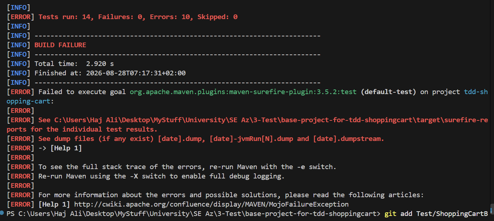 | 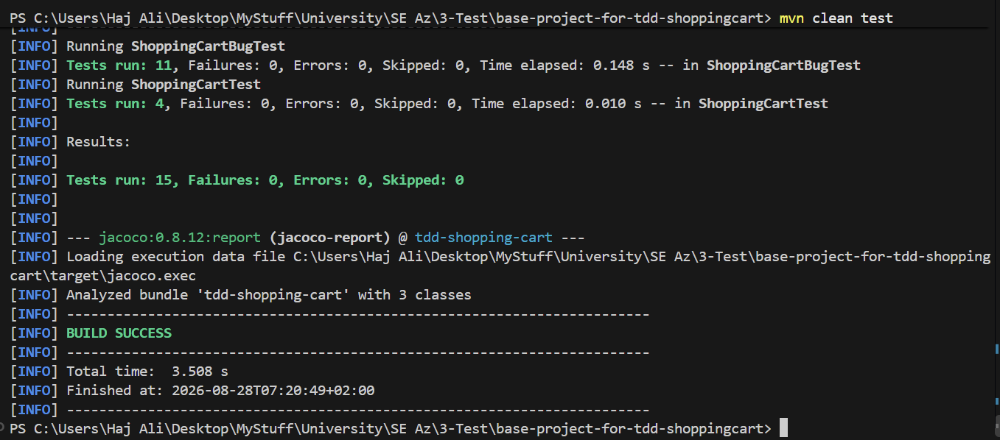 |

### ۵.۳. مرز تخفیف

نیازمندی رسمی می‌گوید:

```text
total > 100  → تخفیف ۱۰٪
total == 100 → بدون تخفیف
```

تست Red ثبت‌شده نیز نشان می‌دهد برای مجموع دقیقاً ۱۰۰، مقدار مورد انتظار `100.0` بوده ولی کد `90.0` برگردانده است:

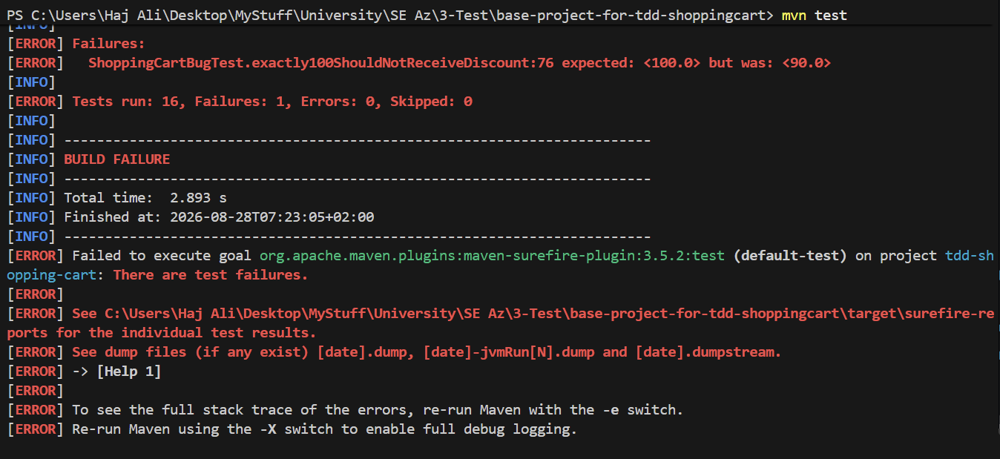

بااین‌حال نسخهٔ فعلی کد هنوز از `total >= 100` استفاده می‌کند و تست فعلی مقدار `90.0` را انتظار دارد. بنابراین تصویر Green موجود فقط سبزبودن مجموعه تست‌های آن مقطع را اثبات می‌کند، نه انطباق با نیازمندی رسمی:

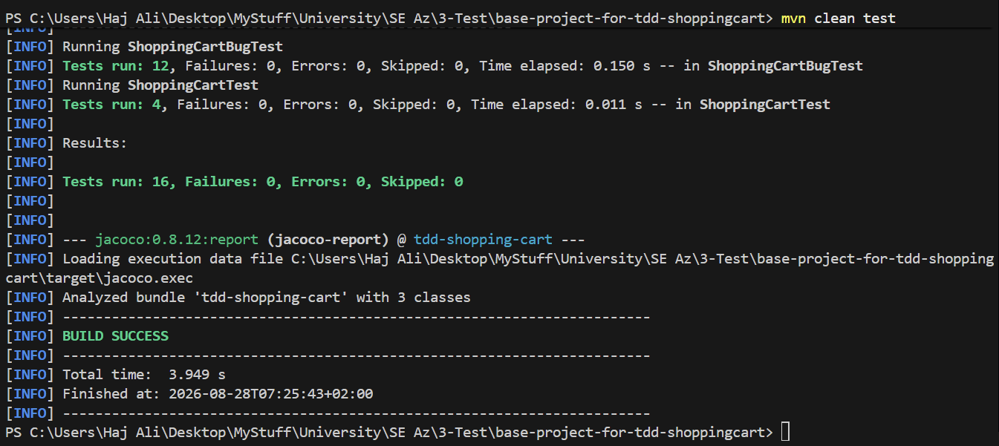

این مغایرت در بخش ۱۲ به‌عنوان اقدام ضروری پیش از تحویل ثبت شده است.

از دید TDD، اهمیت این مورد فقط یک operator نیست: دادهٔ مرزی `100.0` باید تفاوت `>` و `>=` را آشکار کند. تست مقادیر بالاتر مانند `120` به‌تنهایی قادر به تشخیص این جهش نیست، چون هر دو شرط برای آن true هستند. به همین دلیل PIT نیز mutator مخصوص تغییر مرز شرط دارد.

## ۶. پیاده‌سازی `updateItemPrice` با TDD

متد زیر باید قیمت یک کالای موجود را تغییر دهد، بدون آنکه تعداد اقلام عوض شود:

```java
public void updateItemPrice(String name, double newPrice)
```

رفتار کالای ناموجود مطابق تست پروژه به‌صورت no-op انتخاب شد. پیش از پیاده‌سازی، سناریوهای زیر تعریف شدند:

1. تغییر موفق قیمت؛
2. ثابت‌ماندن تعداد اقلام؛
3. عدم تغییر سبد برای کالای ناموجود؛
4. پشتیبانی از قیمت اعشاری؛
5. رد قیمت صفر؛
6. رد قیمت منفی؛
7. رد نام `null`؛
8. رد نام خالی؛
9. محاسبهٔ صحیح مجموع پس از تغییر؛
10. اثر صحیح تغییر قیمت بر محاسبهٔ تخفیف.

ارتباط هر دسته تست با ریسک رفتاری متد:

| دستهٔ تست | ریسک تحت کنترل |
|---|---|
| تغییر موفق و count ثابت | متد نباید به‌جای update، کالا را حذف یا دوباره اضافه کند |
| کالای ناموجود | عملیات ناموفق نباید state را تغییر دهد |
| decimal | امضای `double` و نگهداری مقدار اعشاری باید حفظ شود |
| صفر و منفی | قواعد قیمت در add و update نباید متفاوت باشند |
| `null` و blank | قواعد نام باید در تمام APIها یکسان باشند |
| مجموع چندکالایی | فقط قیمت کالای هدف باید تغییر کند |
| اثر بر تخفیف | محاسبه باید از state جدید و بدون cache کهنه انجام شود |

پیاده‌سازی حداقلی:

```java
public void updateItemPrice(String name, double newPrice) {
    validateName(name);
    validatePrice(newPrice);

    if (items.containsKey(name)) {
        items.put(name, newPrice);
    }
}
```

| Red | Green |
|---|---|
| 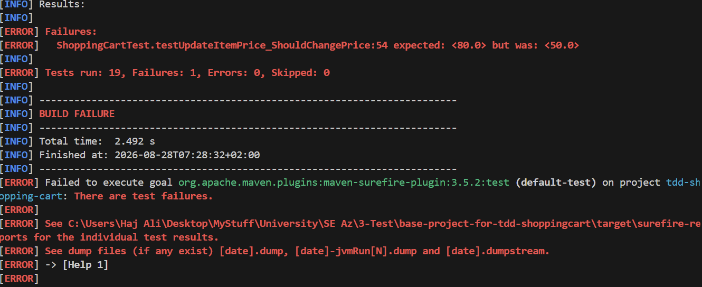 | 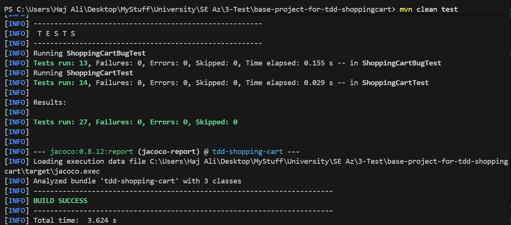 |

پس از Green، جریان متد ساده شد و اعتبارسنجی مشترک با متد افزودن کالا حفظ شد. تست‌های regression نشان دادند تغییر قیمت، تعداد اقلام و سایر رفتارهای سبد را خراب نمی‌کند.

## ۷. قابلیت تجاری دوم: سقف ظرفیت سبد

قابلیت دوم با معیارهای پذیرش زیر تعریف شد:

- سبد باید حداکثر ۱۰۰ کالا بپذیرد؛
- افزودن کالای ۱۰۱ام باید `IllegalStateException` ایجاد کند؛
- عملیات ردشده نباید تعداد یا مجموع سبد را تغییر دهد.

سه تست برای پذیرش ۱۰۰ کالا، رد کالای ۱۰۱ام و حفظ اتمیک وضعیت نوشته شد. حداقل پیاده‌سازی عبارت بود از:

```java
private static final int MAX_ITEMS = 100;

if (items.size() >= MAX_ITEMS) {
    throw new IllegalStateException("Cart capacity exceeded");
}
```

قرارگرفتن بررسی ظرفیت پیش از `items.put` برای اتمیک‌بودن عملیات مهم است. در تست سوم، `oldCount` و `oldTotal` پیش از عملیات ذخیره و پس از exception دوباره مقایسه شدند؛ بنابراین صرف پرتاب exception کافی نبود و عدم تغییر state نیز اثبات شد. از آنجا که duplicate پیش از capacity بررسی می‌شود، تلاش برای افزودن نام تکراری به سبد پر، خطای duplicate تولید می‌کند و ظرفیت را دور نمی‌زند.

| Red | Green |
|---|---|
| 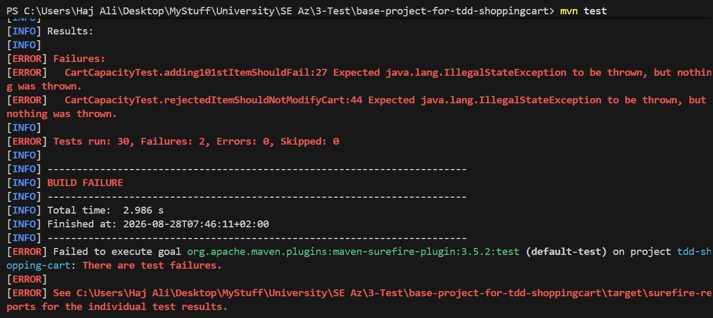 | 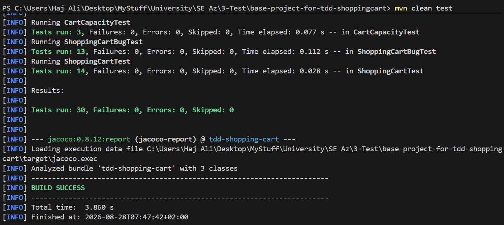 |

## ۸. تست‌های پیشرفته و شکاف‌های پوشش

علاوه بر تست‌های اصلی، موارد زیر پوشش داده شدند:

- نام‌های `null`، empty و whitespace به‌صورت parameterized؛
- قیمت صفر، منفی، اعشاری، `NaN` و مثبت بی‌نهایت؛
- نام تکراری و حفظ وضعیت سبد پس از خطا؛
- مجموع دقیقاً ۱۰۰ و بیشتر از ۱۰۰؛
- تغییر قیمت و اثر آن بر مجموع و تخفیف؛
- ظرفیت ۱۰۰ و تلاش برای افزودن کالای ۱۰۱ام؛
- سناریوی چندمرحله‌ای افزودن، تغییر قیمت و حذف؛
- حذف کالای ناموجود و بازگشت `false`؛
- مجموع کمتر از ۱۰۰ و عدم اعمال تخفیف.

دو تست آخر پس از تحلیل branchهای JaCoCo و mutantهای `NO_COVERAGE` اضافه شدند:

```java
@Test
void removingMissingItemShouldReturnFalse() {
    ShoppingCart cart = new ShoppingCart();

    boolean removed = cart.removeItem("Missing");

    assertFalse(removed);
    assertEquals(0, cart.getItemCount());
    assertEquals(0.0, cart.getTotal());
}
```

```java
@Test
void totalBelow100ShouldNotBeDiscounted() {
    ShoppingCart cart = new ShoppingCart();
    cart.addItem("Book", 99.99);

    double total = cart.getTotalWithDiscount();

    assertEquals(99.99, total, 0.0001);
}
```

در اجرای تمیز نهایی، نتیجهٔ تست‌ها چنین بود:

```text
Tests run: 33
Failures: 0
Errors: 0
Skipped: 0
BUILD SUCCESS
```

تصویر فعلی زیر مربوط به اجرای پیش از افزودن دو تست آخر است و ۳۱ تست را نشان می‌دهد؛ بنابراین باید پیش از تحویل با تصویر اجرای ۳۳ تست جایگزین شود:

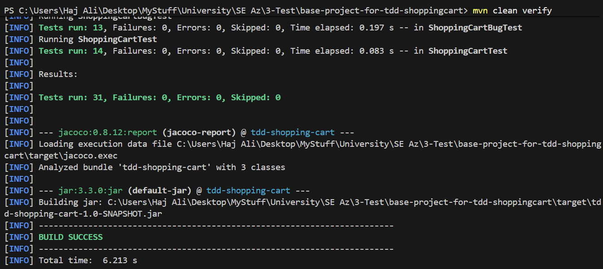

## ۹. تحلیل Coverage با JaCoCo

پس از افزودن دو تست branch، آمار کلاس اصلی تحت آزمون به مقدار زیر رسید:

مقایسهٔ مستقیم baseline و نتیجهٔ نهایی:

| معیار `ShoppingCart` | Baseline | پیش از دو تست PIT | Final |
|---|---:|---:|---:|
| Line Coverage | 16/19 (حدود 84٪) | 33/35 (94.3٪) | 35/35 (100٪) |
| Branch Coverage | 4/6 (66٪) | 18/20 (90٪) | 20/20 (100٪) |
| Method Coverage | 6/7 (حدود 86٪) | 9/9 (100٪) | 9/9 (100٪) |

افزایش تعداد خطوط و branchها در ستون‌های بعدی طبیعی است، زیرا validation، `updateItemPrice` و ظرفیت سبد به کد اصلی اضافه شده‌اند. بنابراین مقایسه فقط با درصد کافی نیست و صورت کسر نیز باید گزارش شود.

| معیار `ShoppingCart` | Missed | Covered | درصد |
|---|---:|---:|---:|
| Line | 0 | 35 | 100٪ |
| Branch | 0 | 20 | 100٪ |
| Method | 0 | 9 | 100٪ |
| Instruction | 0 | 139 | 100٪ |

دو branch ازدست‌رفتهٔ گزارش قبلی عبارت بودند از:

1. مسیر `false` در `removeItem` برای کالای ناموجود؛
2. مسیر `false` شرط تخفیف برای مجموع کمتر از ۱۰۰.

کلاس‌های `Main` و `Item` جزو منطق اصلی مورد آزمون این آزمایش نیستند و تستی برای آن‌ها نوشته نشده است؛ به همین علت آمار کل bundle پایین‌تر از `ShoppingCart` است:

| معیار کل bundle | Covered / Total | درصد |
|---|---:|---:|
| Line | 35 / 46 | 76.09٪ |
| Branch | 20 / 22 | 90.91٪ |
| Method | 9 / 14 | 64.29٪ |

بنابراین هرجا در این گزارش «پوشش ۱۰۰٪» ذکر می‌شود، منظور کلاس هدف `ShoppingCart` است، نه سه کلاس bundle.

## ۱۰. Mutation Testing با PIT

Coverage صرفاً نشان می‌دهد خطی اجرا شده است؛ PIT بررسی می‌کند آیا تست‌ها تغییر عمدی و اشتباه در رفتار را تشخیص می‌دهند یا خیر. نمونهٔ mutationها عبارت‌اند از:

- تغییر `>` به `>=` یا برعکس؛
- معکوس‌کردن `containsKey`؛
- جایگزینی `return false` با `return true`؛
- جایگزینی مقدار بازگشتی `double` با صفر؛
- تغییر جمع به تفریق؛
- حذف فراخوانی validation.

### اجرای اولیهٔ PIT

```text
Generated mutants: 24
Killed mutants:    22
Survived mutants:   0
No Coverage:        2
Mutation Score:     22 / 24 = 91.67٪
Test Strength:      22 / 22 = 100٪
```

دو mutant بدون پوشش مربوط به بازگشت `false` برای حذف کالای ناموجود و بازگشت مقدار بدون تخفیف برای مجموع کمتر از ۱۰۰ بودند.

### اجرای نهایی PIT

پس از افزودن دو تست بخش ۸:

```text
Generated mutants: 24
Killed mutants:    24
Survived mutants:   0
No Coverage:        0
Mutation Score:     24 / 24 × 100 = 100٪
Test Strength:      24 / (24 + 0) × 100 = 100٪
Line Coverage:      35 / 35 × 100 = 100٪
```

خروجی متنی پیش و پس از بهبود در فایل‌های زیر نگهداری شده است:

- [نتیجهٔ اولیهٔ PIT](docs/evidence/pit.txt)
- [نتیجهٔ نهایی PIT](docs/evidence/after-pit.txt)

نکتهٔ مهم این است که PIT در `pom.xml` فقط برای `ShoppingCart` پیکربندی شده است؛ بنابراین نتیجهٔ ۱۰۰٪ به `Main` و `Item` تعمیم داده نمی‌شود. همچنین Mutation Score صددرصد، انطباق با نیازمندی را تضمین نمی‌کند؛ تستی که انتظار اشتباه را تثبیت کند نیز می‌تواند mutantها را بکشد.

## ۱۱. Git و روند توسعه

تاریخچهٔ Git تغییرات را به commitهای مرحله‌ای تقسیم کرده است. نمونهٔ commitهای مهم:

```text
f8d5d13 docs: record baseline test and coverage evidence
5a040a4 test: expose duplicate item overwrite bug
b1ee131 fix: reject duplicate item names
6846953 test: expose invalid item data bug
7d21f3f fix: validate item name and price
55a8e7a test: expose discount boundary bug
f94195a test: define updateItemPrice behavior
d766626 feat: implement updateItemPrice
859ac8e refactor: simplify update item price flow
99c7790 test: define maximum cart capacity behavior
a4d5845 feat: enforce maximum cart capacity
beecf84 test: add advanced boundary and sequence scenarios
64c9c0c docs: record final coverage evidence
```

برای مدیریت جریان کار از Kanban با وضعیت‌های Backlog، Ready، In progress، In review و Done استفاده شد. کارت‌ها شامل baseline، باگ‌ها، `updateItemPrice`، ظرفیت سبد، تست‌های پیشرفته، JaCoCo، PIT و مستندسازی بودند.

## ۱۲. محدودیت و مغایرت باقی‌مانده

در بازبینی نهایی، مهم‌ترین مسئلهٔ باقی‌مانده قاعدهٔ تخفیف است.

صورت رسمی آزمایش می‌گوید مجموع دقیقاً ۱۰۰ **نباید** تخفیف بگیرد؛ اما نسخهٔ فعلی دارای کد زیر است:

```java
if (total >= 100) {
    return total * 0.9;
}
```

تست `exactly100ShouldNotReceiveDiscount` نیز برخلاف نام خود، مقدار `90.0` را انتظار دارد. تصویر Red مرحلهٔ تخفیف نشان می‌دهد انتظار اولیه و منطبق با PDF برابر `100.0` بوده است. بنابراین پیش از تحویل نهایی باید این تصمیم با دستیار درس نهایی شود. اگر متن PDF ملاک باشد، اصلاح صحیح چنین است:

```java
if (total > 100) {
    return total * 0.9;
}
```

و تست مرزی باید برای مجموع ۱۰۰ مقدار `100.0` انتظار داشته باشد. پس از آن لازم است همهٔ تست‌ها، JaCoCo و PIT دوباره اجرا و آمار نهایی جایگزین شوند.

این موضوع همچنین با ممنوعیت تغییر تست‌های اصلی مرتبط است؛ زیرا تست پایهٔ `testDiscountAtBoundary_WRONG` با PDF تعارض دارد. به همین دلیل تصمیم نهایی دربارهٔ تغییر آن باید مستند یا از دستیار درس تأیید شود.

## ۱۳. استفاده از هوش مصنوعی و Codex

مطابق سیاست درس، استفاده از ابزار هوش مصنوعی به‌صورت شفاف ثبت شده است:

- **مدل:** GPT-5.6 Sol؛
- **نوع حساب:** ChatGPT Business؛
- **ابزار استفاده:** ChatGPT/Codex در محیط توسعه؛
- **روش دسترسی:** گفت‌وگوی تعاملی و بازبینی مرحله‌ای کد و خروجی‌ها؛
- **کاربردها:** تحلیل پروژهٔ پایه، پیشنهاد edge case، بررسی شکست تست‌ها، تحلیل JaCoCo، تحلیل PIT، افزودن تست برای branchهای بدون پوشش، بازبینی نهایی و تدوین گزارش؛
- **نحوهٔ تصمیم‌گیری:** پیشنهادهای مدل مستقیماً معیار صحت در نظر گرفته نشدند و با کد، خروجی ابزارها و PDF رسمی مقایسه شدند. کشف مغایرت شرط تخفیف نمونه‌ای از همین بازبینی مستقل است.

خلاصهٔ تعامل‌های معنادار و نحوهٔ استفاده از پاسخ‌ها:

| مرحله | پرسش/نیاز | کاربرد پاسخ مدل | ارزیابی و تصمیم نهایی |
|---|---|---|---|
| ۱ | استخراج الزامات PDF | تهیهٔ checklist مراحل و deliverableها | با PDF رسمی دوباره تطبیق داده شد |
| ۲ | طراحی workflow تک‌نفره و Kanban | تعریف ستون‌ها و کارت‌های TDD | برای GitHub Projects متناسب‌سازی شد |
| ۳ | Baseline Analysis | شناسایی نقاط مشکوک و edge caseها | فقط موارد قابل اثبات با تست پذیرفته شد |
| ۴ | باگ duplicate | پیشنهاد تست حفظ count و total | تست افزوده و failure واقعی ثبت شد |
| ۵ | invalid input | پیشنهاد parameterized test و داده‌های مرزی | `NaN` و Infinity نیز پس از بازبینی افزوده شدند |
| ۶ | discount boundary | تشخیص تفاوت `>` و `>=` | پاسخ درست بود، اما کد فعلی هنوز نیازمند اصلاح نهایی است |
| ۷ | تست‌های `updateItemPrice` | تکمیل حداقل هشت سناریو | ده سناریوی مرتبط با رفتار observable انتخاب شد |
| ۸ | تحلیل Failure متد update | تشخیص خالی‌بودن implementation | حداقل implementation نوشته و سپس refactor شد |
| ۹ | قابلیت تجاری دوم | پیشنهاد Maximum Cart Capacity | به‌علت قابلیت آزمون و نیاز اتمیک‌بودن انتخاب شد |
| ۱۰ | تست‌های پیشرفته | پیشنهاد sequence و boundary test | سناریوی add–update–remove و ورودی‌های پارامتریک اضافه شد |
| ۱۱ | تحلیل JaCoCo | نگاشت branchهای قرمز به مسیرهای واقعی | دو مسیر missing removal و below-100 شناسایی شد |
| ۱۲ | تحلیل PIT | تفسیر `NO_COVERAGE` در برابر `SURVIVED` | به‌جای تغییر production، دو تست رفتاری افزوده شد |
| ۱۳ | محاسبهٔ Mutation Score | بررسی فرمول و اعداد گزارش | با خروجی واقعی `24/24` تطبیق داده شد |
| ۱۴ | بازبینی کل پروژه | اجرای tests، JaCoCo و PIT | آمار سبز تأیید، ولی تعارض نیازمندی تخفیف کشف شد |
| ۱۵ | تدوین README | سازمان‌دهی شواهد و نتایج | متن نهایی با PDF، repo و تصاویر کنترل شد |

نمونه‌ای از نقد پاسخ مدل این بود که در رونوشت اولیه، انجام انفرادی آزمایش بدون قید پذیرفته شده بود؛ درحالی‌که سیاست عمومی درس بر کار گروهی و Kanban تأکید دارد. در این گزارش، وضعیت واقعی انجام انفرادی اعلام شده و ادعای عمومی دربارهٔ مجازبودن آن به‌عنوان قاعدهٔ درس تکرار نشده است. همچنین پیشنهاد مدل دربارهٔ مرز صحیح تخفیف فقط پس از استخراج مستقیم متن PDF پذیرفته شد.

به‌دلیل Business بودن حساب، امکان ایجاد لینک export عمومی برای اشخاص دیگر وجود نداشت. در عوض، رونوشت Markdown پیام‌های قابل مشاهدهٔ کاربر و دستیار همراه پروژه قرار داده شده است:

- [رونوشت کامل تعامل‌ها با مدل](AI_CHATBOT.md)

این فایل شامل promptها، پاسخ‌ها و روند تعامل است و به‌عنوان ضمیمهٔ گزارش ارائه می‌شود. استفاده از مدل نقش دستیار تحلیل و بازبینی داشته و جایگزین اجرای تست‌ها، ارزیابی خروجی‌ها یا تصمیم فنی دانشجو نشده است.

## ۱۴. شواهد و تصاویر

| مرحله | Failure | Success |
|---|---|---|
| Baseline | — | [اجرای اولیه](docs/evidence/00-baseline/initial-tests.png.png) |
| Duplicate item | [Red](docs/evidence/01-duplicate/test-failed.png) | [Green](docs/evidence/01-duplicate/test-passed.png) |
| Invalid input | [Red](docs/evidence/02-invalid-input/test-failed.png) | [Green](docs/evidence/02-invalid-input/test-passed.png) |
| Discount boundary | [Red](docs/evidence/03-discount/test-failed.png) | [Green ثبت‌شده](docs/evidence/03-discount/test-passed.png) |
| updateItemPrice | [Red](docs/evidence/04-updateItemPrice/test-failed.png) | [Green](docs/evidence/04-updateItemPrice/test-passed.png) |
| Cart capacity | [Red](docs/evidence/05-cartcap/test-failed.png) | [Green](docs/evidence/05-cartcap/test-passed.png) |

برای تکمیل بستهٔ تحویل، تصاویر زیر هنوز باید تهیه یا به‌روزرسانی شوند:

1. خروجی نهایی ۳۳ تست؛
2. صفحهٔ JaCoCo کلاس `ShoppingCart` با Line/Branch/Method صددرصد؛
3. گزارش اولیهٔ PIT با دو `NO_COVERAGE`؛
4. گزارش نهایی PIT با ۲۴ mutant کشته‌شده؛
5. تصویر Kanban نهایی؛
6. تصویر تاریخچهٔ Git؛
7. در صورت اصلاح مرز تخفیف، خروجی نهایی تست و PIT پس از اصلاح.

## ۱۵. جمع‌بندی

این آزمایش نشان داد سبزبودن تست‌ها یا حتی Coverage و Mutation Score صددرصد به‌تنهایی اثبات‌کنندهٔ صحت نیازمندی نیست. با اجرای مرحله‌ای TDD، اعتبارسنجی ورودی، جلوگیری از نام تکراری، به‌روزرسانی قیمت و محدودیت ظرفیت سبد توسعه داده شد. تحلیل JaCoCo دو مسیر اجرا‌نشده را آشکار کرد و PIT نشان داد این دو مسیر باعث دو mutant بدون پوشش شده‌اند. با افزودن تست حذف کالای ناموجود و مجموع کمتر از ۱۰۰، هر ۲۴ mutant کشته شدند.

اجرای فعلی از نظر فنی موفق است و ۳۳ تست بدون خطا پاس می‌شوند؛ کلاس `ShoppingCart` نیز پوشش خط و branch صددرصد و Mutation Score صددرصد دارد. بااین‌حال، برای انطباق کامل با PDF رسمی باید تکلیف مرز دقیقاً ۱۰۰ مشخص و سپس شواهد نهایی به‌روزرسانی شود.
